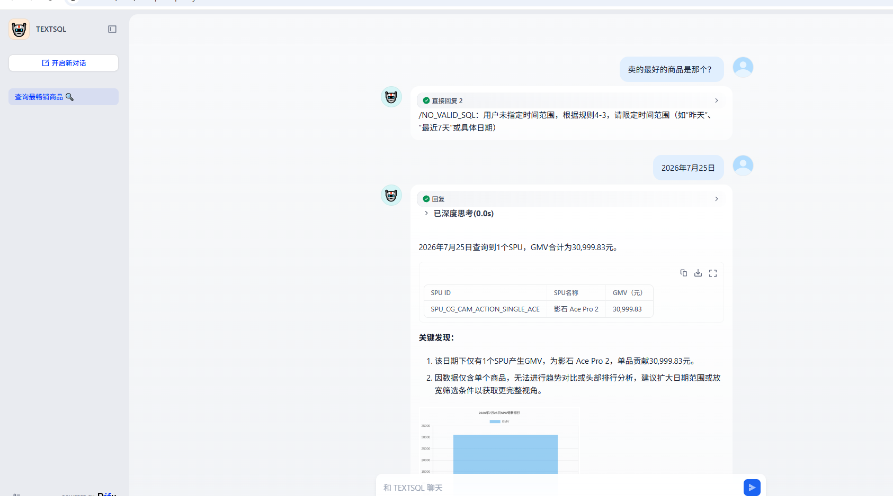

# AIDataAnalysis_StarRocks

原项目参考知乎等社媒平台讨论自动取数架构架构亮点是将底层 OLAP 引擎从 **Apache Doris** 替换为 **StarRocks 3.2.x**，增加物化视图加速查询，并**完整复现数据全栈环境**：

```
Kafka / MySQL（接入）
      │
      ▼
  Apache Flink（流批一体 ETL）
      │   ODS → DWD → DWS → ADS
      ▼
  Apache Paimon 湖仓（mall_dw，本地文件系统）
      │
      ▼
  StarRocks（通过 Paimon 外部 Catalog 直查）
      │
      ▼
  MySQL（用户 / 权限库）
```

> 聚焦**数据开发**：上游 Flink + Paimon 湖仓一体、StarRocks 直查、ADS 层语义。
> 前后端（Flask / React / Dify）仅保留可选启动说明，不展开。
localhost 请自行更换 
## ✨ AI 问数系统运行截图



> 用户用自然语言问"卖的最好的商品是哪个？" → 模型按时间规则反问确认时间范围 → 用户补"2026年7月25日" → 系统查询真实数据 → 输出 Markdown 表格（GMV 30,999.83 元）+ 关键发现 + 柱状图。完整链路：**自然语言 → RAG 召回 Schema → LLM 生成 SQL → StarRocks 查数 → 人话分析 + 图表**。


## 环境要求

- Docker Desktop（已安装并启动）
- Python 3.10+（仅启动前后端时需要）
- Node.js 18+（仅启动前端时需要）

---

## 目录结构

```
AIDataAnalysis_StarRocks/
├── backend/                    # Flask 后端（可选）
├── frontend/                   # React + Vite 前端（可选）
├── dify/                       # Dify 工作流（可选）（Dify巨坑：会出现网络故障，具体解决可以参考相关帖子）
├── docker/
│   ├── mysql/init.sql          # MySQL 初始化（users 表 + admin 账号）
│   ├── starrocks/init.sql      # StarRocks 初始化（外部 Paimon Catalog + 本地 mall_dw）
│   └── flink/
│       ├── Dockerfile          # 自构建 Flink 1.17.2 + Paimon 镜像（官方镜像国内拉不动）（踩的巨坑配置好Docker网络环境，拷打四大件基础！）
│       ├── entrypoint.sh       # Flink 容器入口（处理 jobmanager/taskmanager 角色）
│       ├── lib/                # Flink 所需 jar（paimon / hadoop / kafka connector）
│       └── init/
│           └── paimon_demo.sql # Flink+Paimon 全链路 ETL（ODS→DWD→DWS→ADS）
├── docker-compose.yml          # Flink + Paimon + Kafka + StarRocks + MySQL 一键启动
├── start.bat / start.ps1       # Windows 启动脚本（只启动环境，不自动跑 ETL）
├── stop.bat / stop.ps1         # Windows 停止脚本
├── init_starrocks.bat / init_starrocks.ps1  # Windows StarRocks 初始化脚本
└── README.md
```

---

## 第一步：启动完整数据栈

### Windows

```powershell
.\start.ps1        # 推荐 PowerShell
# 或
start.bat
```

脚本会：检查并构建本地 `flink-with-paimon:1.17.2` 镜像（首次需要 2-5 分钟）→ 启动 5 个容器 → 等 MySQL/StarRocks/Flink 就绪。**不会自动跑 ETL**，初始化与 ETL 请自行执行。

### macOS / Linux

```bash
# 首次需要构建本地 Flink 镜像（之后可跳过）
docker build -t flink-with-paimon:1.17.2 docker/flink

# 启动 5 个容器
docker compose up -d

# 等 StarRocks 就绪
until curl -s http://localhost:8030/api/health | grep -q OK; do sleep 3; done

# 等 Flink 就绪
until curl -s -o /dev/null -w "%{http_code}" http://localhost:8081/overview | grep -q 200; do sleep 3; done
```

启动成功后各服务：

| 服务 | 地址 | 账号 |
|---|---|---|
| StarRocks 查询 | `localhost:9030` | `root` / 无密码 |
| StarRocks WebUI | `http://localhost:8030` | `root` / 无密码 |
| Flink WebUI | `http://localhost:8081` | — |
| MySQL | `localhost:3307` | `root` / `123456` |
| Kafka | `localhost:9092` | — |

---

## 第二步：初始化 StarRocks + 跑 Flink+Paimon ETL

环境启动后，自行决定是否初始化数据、填充湖仓：

### Windows（推荐双击脚本）

```powershell
.\init_starrocks.ps1        # 推荐 PowerShell
# 或
init_starrocks.bat
```

### 手动命令

Windows CMD 的 `<` 重定向在 `docker exec -i` 下经常失效，建议用 `docker cp + source`：

```bash
# 1) 初始化 StarRocks（外部 Paimon Catalog + 本地 mall_dw + 物化视图）
docker cp docker/starrocks/init.sql sr-ai-analysis:/tmp/init.sql
docker exec sr-ai-analysis mysql -P9030 -h127.0.0.1 -uroot -e "source /tmp/init.sql"

# 2) 跑 Flink+Paimon ETL，把 ODS→DWD→DWS→ADS 写入 Paimon 湖仓
#    （Flink sql-client 从 stdin 读文件在 Windows 下也建议先 cp 进容器）
docker cp docker/flink/init/paimon_demo.sql flink-jobmanager:/tmp/paimon_demo.sql
docker exec flink-jobmanager ./bin/sql-client.sh -f /tmp/paimon_demo.sql
```

---

## 第三步：验证「Flink 写 Paimon → StarRocks 直查」

这是本项目数据链路的核心。在 StarRocks 里直接查 Flink 写出的 Paimon 湖仓：

```sql
-- 连 StarRocks
mysql -P9030 -h127.0.0.1 -uroot

-- 切到 Paimon 外部 Catalog
SET CATALOG paimon_catalog1;
USE mall_dw;

-- 查 ADS 层（Flink ETL 生成的）
SELECT * FROM ads_trade_overview_di ORDER BY dt DESC;
SELECT * FROM ads_channel_conversion_di WHERE dt='20260720';
SELECT * FROM ads_product_sales_rank_di WHERE dt='20260720' ORDER BY sale_amount DESC;
```

> `paimon_catalog1.mall_dw.*` 这几张表就是原项目 Dify prompt 里写死的
> `paimon_catalog1.mall_dw.ads_*_di`，现在本地可端到端跑通。

---

## 第四步（可选）：手动操作 Flink / Kafka

进 Flink SQL Client 自己写 ETL：

```bash
docker exec -it flink-jobmanager ./bin/sql-client.sh
```

Kafka 建主题 / 生产消息（演示接入层）：

```bash
docker exec -it kafka-ai-analysis kafka-topics.sh \
  --create --topic order-events --bootstrap-server kafka:9092 --partitions 1 --replication-factor 1
```

---

## 第五步（可选）：启动前后端 / Dify

- 后端：`cd backend && pip install -r requirements.txt`，分别启动 `app.py` / `starrocks_service.py` / `auth_service.py`
- 前端：`cd frontend && npm install && npm run dev` → `http://localhost:3000`（admin / 123456）
- Dify：导入 `dify/AI数据分析工作流.yml`，把 HTTP 节点 URL 改成 `/api/starrocks/query`

---

## 进阶：Paimon 湖仓使用阿里云 OSS 存储

Flink 侧已内置 `paimon-oss-0.8.1.jar`，默认挂载在 `/opt/flink/lib/paimon-oss-0.8.1.jar`。

创建基于 OSS 的 Paimon Catalog：

```sql
CREATE CATALOG paimon_oss_catalog WITH (
    'type' = 'paimon',
    'warehouse' = 'oss://<your-bucket>/<warehouse-path>',
    'fs.oss.endpoint' = 'oss-cn-hangzhou.aliyuncs.com',
    'fs.oss.accessKeyId' = '<your-access-key-id>',
    'fs.oss.accessKeySecret' = '<your-access-key-secret>'
);

USE CATALOG paimon_oss_catalog;
CREATE DATABASE IF NOT EXISTS mall_dw;
```

> 替换为自己的 Bucket、Endpoint、AccessKey。RAM 子账号建议只给 OSS 目标 bucket 的读写权限。

### StarRocks 直查 OSS 上的 Paimon

StarRocks allin1 3.2.11 镜像**已内置 `paimon-oss-0.8.1.jar`**（FE 和 BE 的 Paimon reader 目录都有），无需手动再放 jar，直接创建外部 Catalog 即可：

```sql
CREATE EXTERNAL CATALOG paimon_oss_catalog
PROPERTIES (
    "type" = "paimon",
    "paimon.catalog.type" = "filesystem",
    "paimon.catalog.warehouse" = "oss://<your-bucket>/<warehouse-path>",
    "paimon.fs.oss.endpoint" = "oss-cn-hangzhou.aliyuncs.com",
    "paimon.fs.oss.accessKeyId" = "<your-access-key-id>",
    "paimon.fs.oss.accessKeySecret" = "<your-access-key-secret>"
);

SET CATALOG paimon_oss_catalog;
USE mall_dw;
SELECT * FROM ads_trade_overview_di ORDER BY dt DESC;
```

---

## 物化视图说明

StarRocks 3.2.x 原生支持异步物化视图。`docker/starrocks/init.sql` 中示例：

```sql
CREATE MATERIALIZED VIEW IF NOT EXISTS mv_trade_overview_7d
AS
SELECT dt, SUM(total_gmv) AS sum_gmv,
       SUM(total_order_cnt) AS sum_order_cnt,
       SUM(paid_order_cnt) AS sum_paid_order_cnt
FROM mall_dw.ads_trade_overview_di
GROUP BY dt;
```

业务频繁查"最近 7 天 GMV 趋势"时，StarRocks 自动路由到物化视图加速。

---

## 常见问题

### 1. StarRocks allin1 镜像启动慢
正常现象，首次 1~2 分钟。用 `http://localhost:8030/api/health` 观察。

### 2. StarRocks 怎么直查 Paimon？
allin1 3.2.11 **已内置 Paimon 读取库**（`/data/deploy/starrocks/fe/lib/paimon-bundle-0.8.1.jar` 等），无需额外装插件。
`docker/starrocks/init.sql` 已建好外部 Catalog：

```sql
CREATE EXTERNAL CATALOG paimon_catalog1 PROPERTIES (
    "type" = "paimon",
    "paimon.catalog.type" = "filesystem",
    "paimon.catalog.warehouse" = "/paimon_warehouse"
);
```

`/paimon_warehouse` 是 docker 共享卷，Flink 与 StarRocks 挂载在同一路径，所以 StarRocks 能直接读 Flink 写出的湖仓。

### 3. 想用真实 OSS 存储？
把 Flink catalog 与 StarRocks 外部 Catalog 的 warehouse 改成 `oss:///mall-dw/`，并补 OSS endpoint / key 即可（本地演示用文件系统等价还原）。

### 4. 停止环境
```powershell
.\stop.ps1   # 或 stop.bat
```

---

## 数据开发学习路线（基于本环境）

1. **ADS 层 5 张表语义**：`dt` 用 `yyyyMMdd` 字符串、按 `dt` 分区、DECIMAL 精度。--本数仓数据有个人偏好，不上传具体Flink sql和数据！！
2. **Flink+Paimon ETL**：读 `docker/flink/init/paimon_demo.sql`，理解 ODS→DWD→DWS→ADS。
3. **StarRocks 外部 Catalog**：`SET CATALOG paimon_catalog1` 直查湖仓。
4. **物化视图加速**：`mv_trade_overview_7d` 自动路由。
5. **权限与 Text2SQL**：见 `backend/` 与 `dify/`（前后端，可选）。
